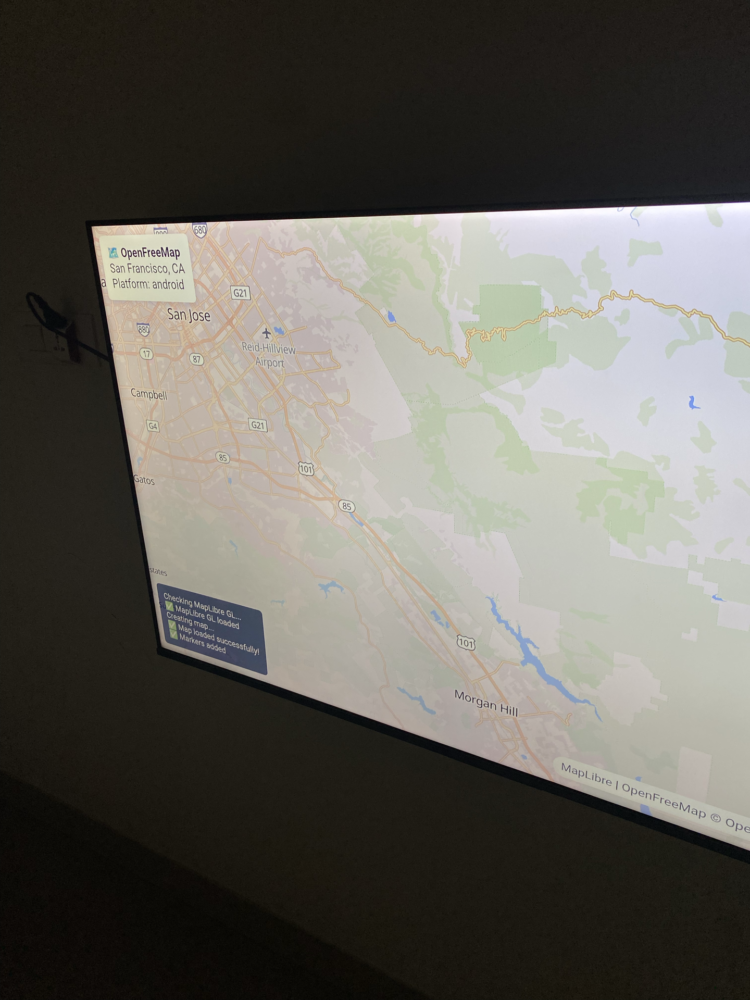
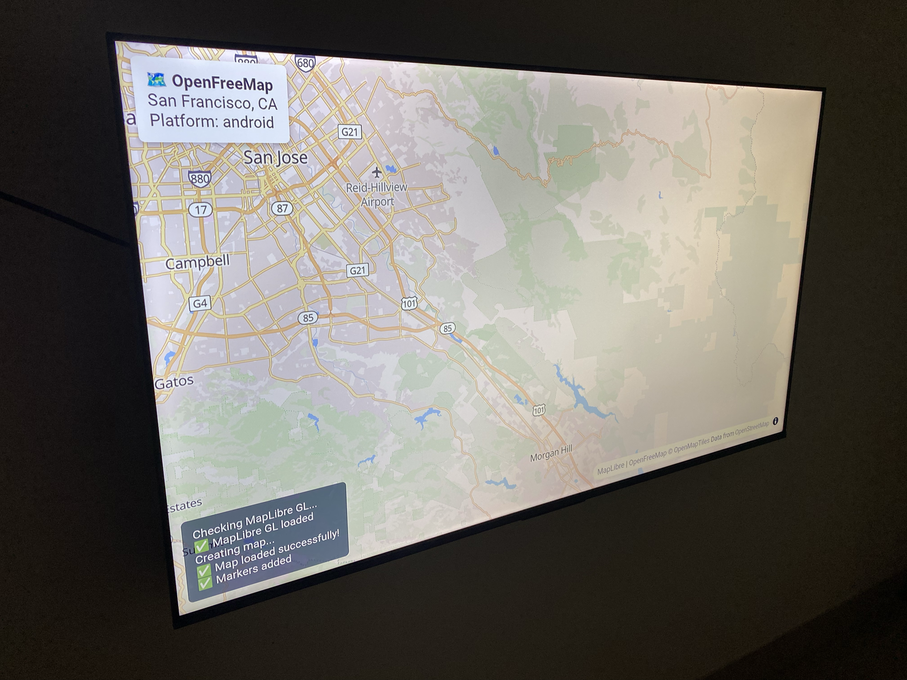

# dwindow

A React Native TV application built with Expo that provides interactive map functionality on Android TV and web platforms. dwindow combines the power of OpenFreeMap with MapLibre GL JS to deliver a seamless mapping experience optimized for television interfaces.

## Demo


*Live demonstration of the application*


*Web interface showing the interactive map*


*Android TV interface with remote navigation*

## Overview

dwindow is designed to run on both web browsers and Android TV devices, featuring:
- Interactive maps powered by OpenFreeMap and MapLibre GL JS
- TV-optimized navigation with remote control support
- WebView-based map rendering for cross-platform compatibility
- 32-bit ARM architecture support for older Android TV devices

## Prerequisites

### System Requirements

- **Node.js**: LTS version (18.x or later)
- **Java**: OpenJDK 17 (required for Android builds)
- **Android Studio**: Iguana or later
- **Android SDK**: API level 31 or higher
- **Android TV System Image**: For emulator testing

### Development Environment Setup

1. **Install Node.js and npm**
   ```bash
   # Verify installation
   node --version
   npm --version
   ```

2. **Install Java 17**
   ```bash
   # macOS with Homebrew
   brew install openjdk@17
   
   # Verify installation
   java -version
   ```

3. **Install Android Studio**
   - Download from [developer.android.com](https://developer.android.com/studio)
   - Install Android SDK API 31+ and Android TV system image
   - Set up environment variables:
   ```bash
   export ANDROID_HOME=$HOME/Library/Android/sdk
   export PATH=$PATH:$ANDROID_HOME/platform-tools
   ```

## Installation

1. **Clone the repository**
   ```bash
   git clone <repository-url>
   cd dwindow
   ```

2. **Install dependencies**
   ```bash
   npm install
   ```

3. **Set up environment variables**
   ```bash
   # Create .env file
   touch .env
   
   # Add required environment variables
   echo "MAPBOX_ACCESS_TOKEN=your_mapbox_token_here" >> .env
   echo "GOOGLE_MAPS_TOKEN=your_google_maps_token_here" >> .env
   ```

4. **Configure for TV development**
   ```bash
   EXPO_TV=1 npx expo prebuild --clean
   ```

## Development Workflow

### Web Development (Fast Iteration)

For rapid development and testing, use the web version:

```bash
# Start web development server
npx expo start --web --port 8082
```

Open `http://localhost:8082` in your browser to test changes instantly.

### Android TV Development

For TV-specific development and testing:

```bash
# Set up environment variables
export ANDROID_HOME=$HOME/Library/Android/sdk
export PATH=$PATH:$ANDROID_HOME/platform-tools
export JAVA_HOME=/opt/homebrew/Cellar/openjdk@17/17.0.16/libexec/openjdk.jdk/Contents/Home

# Build and run on Android TV
EXPO_TV=1 npx expo run:android --no-install
```

### Available Scripts

- `npm run start` - Start development server for TV
- `npm run android` - Build and run on Android TV
- `npm run ios` - Build and run on Apple TV
- `npm run web` - Start web development server
- `npm run prebuild` - Run Expo prebuild for mobile
- `npm run prebuild:tv` - Run Expo prebuild for TV

## Architecture

### Project Structure

```
dwindow/
├── app/                    # Expo Router pages
│   ├── index.tsx          # Main application entry point
│   └── _layout.tsx        # Root layout configuration
├── components/            # Reusable components
│   └── maps.webview.tsx   # WebView-based map component
├── android/               # Android-specific configuration
│   ├── app/
│   │   └── build.gradle   # Build configuration (32-bit ARM)
│   └── gradle.properties  # Gradle properties
├── app.json              # Expo configuration
├── eas.json              # EAS Build configuration
└── package.json          # Dependencies and scripts
```

### Key Components

- **maps.webview.tsx**: Main map component using WebView with MapLibre GL JS
- **app/index.tsx**: Application entry point with platform detection
- **android/app/build.gradle**: Android build configuration targeting ARM v7a

## Build Configuration

### Android TV Build Settings

The project is configured for 32-bit ARM architecture to support older Android TV devices:

```gradle
// android/app/build.gradle
ndk {
    abiFilters 'armeabi-v7a'  // 32-bit ARM for TV compatibility
}
```

```properties
# android/gradle.properties
reactNativeArchitectures=armeabi-v7a
```

### TV-Specific Features

- **Remote Navigation**: D-pad support with focus management
- **TV-Optimized UI**: Scaled components for TV viewing distances
- **WebView Rendering**: Cross-platform map display using MapLibre GL JS

## Deployment

### Local Development Builds

```bash
# Build development APK
export ANDROID_HOME=$HOME/Library/Android/sdk
export PATH=$PATH:$ANDROID_HOME/platform-tools
export JAVA_HOME=/opt/homebrew/Cellar/openjdk@17/17.0.16/libexec/openjdk.jdk/Contents/Home
EXPO_TV=1 npx expo run:android --no-install
```

### EAS Build (Cloud)

For production builds or when local builds fail:

```bash
# Install EAS CLI
npm install -g @expo/eas-cli

# Configure EAS
npx eas build:configure

# Build for Android TV
npx eas build --platform android --profile development_tv
```

## Device Setup

### Android TV Connection

1. **Enable Developer Options**
   - Go to Settings > Device Preferences > About
   - Click on "Build" 7 times to enable Developer Options

2. **Enable USB Debugging**
   - Go to Settings > Device Preferences > Developer Options
   - Enable "USB Debugging" and "Install via USB"

3. **Connect via ADB**
   ```bash
   # Connect over Wi-Fi
   adb connect <TV_IP_ADDRESS>:5555
   
   # Verify connection
   adb devices
   ```

### Testing on Physical Device

```bash
# Install APK on connected TV
adb install android/app/build/outputs/apk/debug/app-debug.apk

# Launch application
adb shell am start -n com.tsetarsh.dwindow/.MainActivity

# View logs
adb logcat | grep -E "(dwindow|Expo|ReactNative)"
```

## Troubleshooting

### Common Issues

1. **Build Failures with CMake**
   - Ensure Java 17 is installed and set as JAVA_HOME
   - Clean build directories: `rm -rf android/app/build android/build`

2. **Architecture Mismatch**
   - Verify build configuration targets ARM v7a (32-bit)
   - Check `android/app/build.gradle` and `android/gradle.properties`

3. **WebView Not Loading**
   - Ensure `react-native-webview` is properly installed
   - Check WebView permissions in Android manifest

4. **Map Not Rendering**
   - Verify MapLibre GL JS is loading in WebView
   - Check browser console for JavaScript errors
   - Ensure network connectivity for map tiles

### Debug Commands

```bash
# Clear Metro cache
npx expo start --clear

# Reset Watchman
watchman watch-del '/path/to/dwindow'
watchman watch-project '/path/to/dwindow'

# Clean Android build
cd android && ./gradlew clean && cd ..

# View detailed logs
DEBUG=expo:* npx expo start --dev-client
```

## Contributing

1. Fork the repository
2. Create a feature branch: `git checkout -b feature/new-feature`
3. Make your changes and test on both web and TV
4. Commit your changes: `git commit -m 'Add new feature'`
5. Push to the branch: `git push origin feature/new-feature`
6. Submit a pull request

## License

This project is licensed under the MIT License. See the LICENSE file for details.

## Support

For issues and questions:
- Check the troubleshooting section above
- Review Expo documentation: [docs.expo.dev](https://docs.expo.dev)
- React Native TV documentation: [github.com/react-native-tvos](https://github.com/react-native-tvos)
