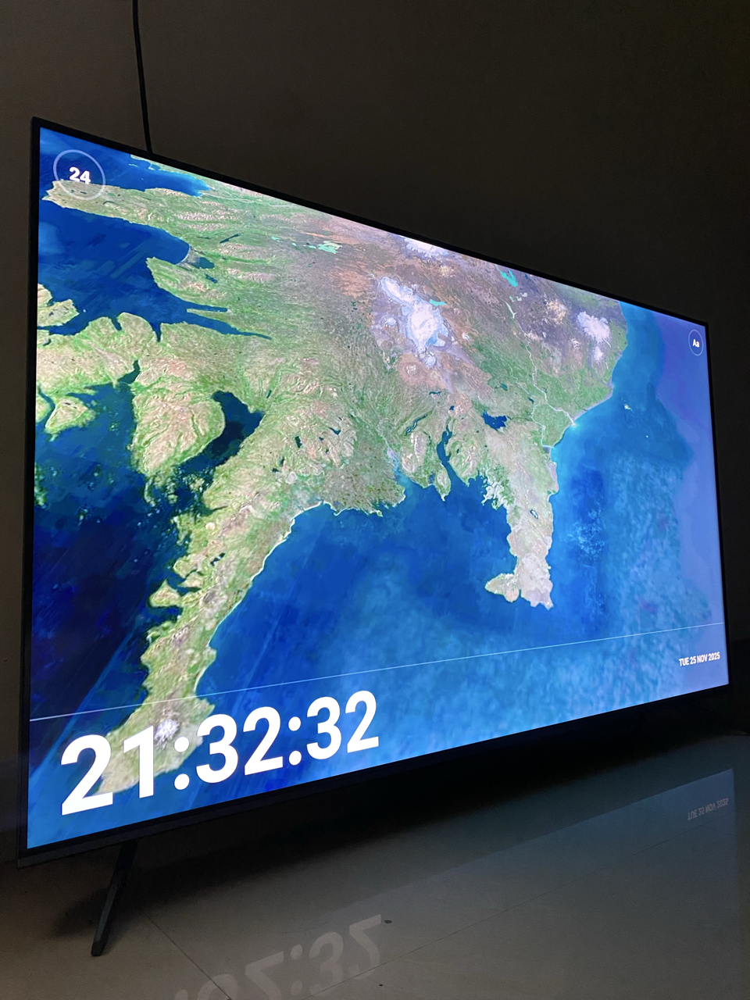

# dwindow

A beautiful screensaver-style app for TV that displays an interactive 3D globe map with automatic location cycling and a digital clock overlay. Built with Expo, MapLibre GL JS, and optimized for Android TV, Apple TV, and web platforms.

> **Note**: Currently runs as a standalone app. System screensaver integration coming soon.

## See It In Action

Watch dwindow in action with smooth location transitions, beautiful 3D globe rendering, and TV-optimized interactions.


*Main demo showcasing the screensaver cycling through multiple locations at 6x speed*



*Running on TV with crisp satellite imagery and digital clock overlay*


*Interactive TV remote navigation demo*

**[Download 60fps MP4 Video](assets/images/demo/dwindow-demo.mp4)** - High-quality video demonstration

## Features

- **3D Globe Screensaver**: Interactive globe with satellite imagery using MapLibre GL JS
- **Automatic Location Cycling**: Smoothly flies through 12 amazing locations worldwide
- **Sky & Atmosphere**: Realistic sky rendering with atmosphere blend
- **Digital Clock Overlay**: Customizable clock with 10 font options and 12/24-hour format
- **Continuous Rotation**: Globe rotates continuously in the background
- **TV Optimized**: Designed for Android TV and Apple TV (standalone app, not yet integrated with system screensaver)

## Quick Start

```bash
# Install dependencies
npm install

# Start development server
npm run start

# Run on web
npm run web

# Run on Android TV
npm run android

# Run on Apple TV
npm run ios
```

## Tech Stack

- **Framework**: Expo SDK 54 with Expo Router
- **React Native**: react-native-tvos@0.81.4-0
- **Maps**: MapLibre GL JS 5.7.2
- **Map Tiles**: MapTiler Satellite
- **Fonts**: expo-font with custom TTF files

## Platform Support

- ✅ Web (Chrome, Firefox, Safari)
- ✅ Android TV (32-bit ARM support)
- ✅ Apple TV

## Development

### Prerequisites

- Node.js 18+
- Java 17 (for Android builds)
- Android Studio (for TV builds)

## License

MIT
